# App Map

**Generated:** 2026-07-26T21:56:35.277489
**Stack:** React
**Language:** TypeScript
**Source files:** 49

## What This App Does

Nudge is a desktop productivity app that sits in your system tray and sends gentle reminders ('nudges') when tasks have been sitting too long. You create projects with tasks, set a nudge interval for each project, and the app notifies you when it's time to check back in. It can optionally sync tasks from Workflowy.

---

# How It Works — Overview

This section groups the app by what you do, not by code files.
Each box is a high-level workflow. Click or use the component names
to request a change to a specific piece.

```mermaid
graph TB
    subgraph wf_focus_view_daily_work["Focus View & Daily Work"]
        wf_focus_view_daily_work_desc["See all active projects at a glance, complete or snooze tasks, and trigger nudges"]
        style wf_focus_view_daily_work_desc fill:#f0f0f0,stroke:#ccc
        app["Orchestrates the entire app interface"]
        focusview["Dashboard of next tasks sorted by urgency"]
        toast["Shows brief confirmation messages"]
        toggle["Turns settings on and off"]
    end
    subgraph wf_project_task_management["Project & Task Management"]
        wf_project_task_management_desc["Create, edit, organize, and navigate projects and their tasks"]
        style wf_project_task_management_desc fill:#f0f0f0,stroke:#ccc
        projectmodal["Create or edit a project"]
        projectview["View and manage a project's tasks"]
        sidebar["Navigate between projects"]
        taskmodal["Add or edit a task"]
        tasklist["Organize and reorder tasks"]
    end
    subgraph wf_settings_configuration["Settings & Configuration"]
        wf_settings_configuration_desc["Customize notification behavior, quiet hours, Workflowy integration, and startup options"]
        style wf_settings_configuration_desc fill:#f0f0f0,stroke:#ccc
        settingsmodal["Configure all app settings"]
        usenotifications["Manage notification permissions"]
        modal["Reusable dialog container for modals"]
    end
    subgraph wf_nudging_engine["Nudging Engine"]
        wf_nudging_engine_desc["Background system that tracks task age, enforces cooldowns, respects quiet hours, and sends notifications"]
        style wf_nudging_engine_desc fill:#f0f0f0,stroke:#ccc
        usenudgetimer["Periodic check for overdue tasks"]
        notifications["Sends and rate-limits nudges"]
        time["Calculates nudge schedules and quiet hours"]
        tasktiming["Tracks active task focus duration"]
        snoozeoverlay["Remembers snoozed tasks across syncs"]
        electron_notificationoptions["Controls how OS notifications appear"]
    end
    subgraph wf_workflowy_sync["Workflowy Sync"]
        wf_workflowy_sync_desc["Connect a Workflowy account to import projects and keep completion status in sync"]
        style wf_workflowy_sync_desc fill:#f0f0f0,stroke:#ccc
        workflowyadapter["Syncs projects and tasks from Workflowy"]
    end
    subgraph wf_data_storage["Data Storage"]
        wf_data_storage_desc["Persists all app data in the browser and defines the data model"]
        style wf_data_storage_desc fill:#f0f0f0,stroke:#ccc
        localstorageadapter["Saves data in browser localStorage"]
        uid["Generates unique IDs"]
        storage_config["Defines storage key and app constants"]
        types["Defines the shape of all app data"]
    end
    subgraph wf_desktop_integration["Desktop Integration"]
        wf_desktop_integration_desc["Electron shell providing system tray, window management, and IPC between main and renderer processes"]
        style wf_desktop_integration_desc fill:#f0f0f0,stroke:#ccc
        electron_main["Manages window, tray, and IPC handlers"]
        electron_preload["Bridges Electron APIs to the web app"]
        electron_startup["Sets up auto-launch on login"]
        useappstate["Central state management hook"]
    end
    wf_focus_view_daily_work -->|triggers| wf_project_task_management
    wf_project_task_management -->|triggers| wf_data_storage
    wf_nudging_engine -->|triggers| wf_settings_configuration
    wf_nudging_engine -->|triggers| wf_focus_view_daily_work
    wf_workflowy_sync -->|triggers| wf_settings_configuration
    wf_desktop_integration -->|triggers| wf_data_storage
    wf_desktop_integration -->|triggers| wf_workflowy_sync
```



### Focus View & Daily Work
_See all active projects at a glance, complete or snooze tasks, and trigger nudges_

- **Orchestrates the entire app interface** — internal name: `App`
- **Dashboard of next tasks sorted by urgency** — internal name: `FocusView`
- **Shows brief confirmation messages** — internal name: `Toast`
- **Turns settings on and off** — internal name: `Toggle`

### Project & Task Management
_Create, edit, organize, and navigate projects and their tasks_

- **Create or edit a project** — internal name: `ProjectModal`
- **View and manage a project's tasks** — internal name: `ProjectView`
- **Navigate between projects** — internal name: `Sidebar`
- **Add or edit a task** — internal name: `TaskModal`
- **Organize and reorder tasks** — internal name: `TaskList`

### Settings & Configuration
_Customize notification behavior, quiet hours, Workflowy integration, and startup options_

- **Configure all app settings** — internal name: `SettingsModal`
- **Manage notification permissions** — internal name: `useNotifications`
- **Reusable dialog container for modals** — internal name: `Modal`

### Nudging Engine
_Background system that tracks task age, enforces cooldowns, respects quiet hours, and sends notifications_

- **Periodic check for overdue tasks** — internal name: `useNudgeTimer`
- **Sends and rate-limits nudges** — internal name: `notifications`
- **Calculates nudge schedules and quiet hours** — internal name: `time`
- **Tracks active task focus duration** — internal name: `taskTiming`
- **Remembers snoozed tasks across syncs** — internal name: `snoozeOverlay`
- **Controls how OS notifications appear** — internal name: `Electron NotificationOptions`

### Workflowy Sync
_Connect a Workflowy account to import projects and keep completion status in sync_

- **Syncs projects and tasks from Workflowy** — internal name: `WorkflowyAdapter`

### Data Storage
_Persists all app data in the browser and defines the data model_

- **Saves data in browser localStorage** — internal name: `LocalStorageAdapter`
- **Generates unique IDs** — internal name: `uid`
- **Defines storage key and app constants** — internal name: `storage config`
- **Defines the shape of all app data** — internal name: `types`

### Desktop Integration
_Electron shell providing system tray, window management, and IPC between main and renderer processes_

- **Manages window, tray, and IPC handlers** — internal name: `Electron Main`
- **Bridges Electron APIs to the web app** — internal name: `Electron Preload`
- **Sets up auto-launch on login** — internal name: `Electron Startup`
- **Central state management hook** — internal name: `useAppState`

---

# Component Map — Detailed

This is the technical view. Each component maps to specific files and is used for scoped editing.

```mermaid
graph TB
    subgraph Component
        App["App: Root component that wires routing, modals, nudge timer, and state"]
        Sidebar["Sidebar: Navigation sidebar showing project list and sync status"]
        TaskList["TaskList: Draggable task list with complete, snooze, edit, delete actions"]
        ProjectModal["ProjectModal: Modal dialog for creating or editing a project"]
        TaskModal["TaskModal: Modal dialog for adding or editing task details"]
        SettingsModal["SettingsModal: Full settings panel for notifications, Workflowy, and storage"]
        Modal["Modal: Reusable modal shell with backdrop, header, body, footer"]
        Toast["Toast: Temporary notification bar for user action feedback"]
        Toggle["Toggle: Reusable on/off toggle switch"]
    end
    subgraph Page
        FocusView["FocusView: Dashboard listing active projects sorted by next nudge time"]
        ProjectView["ProjectView: Detail view of a single project with its task list"]
    end
    subgraph Service
        useAppState["useAppState: Central state hook bridging adapters to React components"]
        useNudgeTimer["useNudgeTimer: Background timer that checks projects and triggers nudges"]
        useNotifications["useNotifications: Manages browser notification permission state"]
        WorkflowyAdapter["WorkflowyAdapter: API client that syncs projects and tasks from Workflowy"]
        notifications["notifications: Nudge scheduling, cooldown logic, and OS notification dispatch"]
        Electron_Main["Electron Main: Electron main process: window, tray, IPC handlers, lifecycle"]
    end
    subgraph Database
        LocalStorageAdapter["LocalStorageAdapter: Persists projects, tasks, and settings in browser localStorage"]
    end
    subgraph Utility
        taskTiming["taskTiming: Tracks when each task became the active focus item"]
        snoozeOverlay["snoozeOverlay: Persists snooze state for Workflowy tasks across syncs"]
        time["time: Duration formatting, quiet hours check, and nudge schedule math"]
        uid["uid: Generates unique IDs for projects and tasks"]
        Electron_NotificationOptions["Electron NotificationOptions: Resolves notification display options for OS notifications"]
        Electron_Startup["Electron Startup: Configures login item for launch-on-startup behavior"]
    end
    subgraph Config
        storage_config["storage config: App configuration constants including storage key and display name"]
        types["types: Domain types, default settings, and global declarations"]
    end
    subgraph Middleware
        Electron_Preload["Electron Preload: Context bridge exposing Electron APIs to the renderer process"]
    end
    App --> useAppState
    App --> useNudgeTimer
    App --> FocusView
    App --> Sidebar
    App --> ProjectView
    App --> ProjectModal
    App --> TaskModal
    App --> SettingsModal
    App --> Toast
    FocusView --> time
    FocusView --> notifications
    ProjectView --> TaskList
    TaskList --> time
    ProjectModal --> Modal
    TaskModal --> Modal
    SettingsModal --> Modal
    SettingsModal --> Toggle
    SettingsModal --> WorkflowyAdapter
    useAppState --> LocalStorageAdapter
    useAppState --> WorkflowyAdapter
    useAppState --> snoozeOverlay
    useNudgeTimer --> notifications
    useNudgeTimer --> time
    LocalStorageAdapter --> taskTiming
    LocalStorageAdapter --> uid
    LocalStorageAdapter --> storage_config
    WorkflowyAdapter --> Electron_Preload
    notifications --> time
    snoozeOverlay --> taskTiming
    time --> taskTiming
    Electron_Main --> Electron_Preload
    Electron_Main --> Electron_Startup
    Electron_Main --> Electron_NotificationOptions
```



## All Components

### App (component)
_Root component that wires routing, modals, nudge timer, and state_

Files:
- `src/App.tsx`
Depends on: useAppState, useNudgeTimer, FocusView, Sidebar, ProjectView, ProjectModal, TaskModal, SettingsModal, Toast

### FocusView (page)
_Dashboard listing active projects sorted by next nudge time_

Files:
- `src/components/FocusView.tsx`
- `src/components/FocusView.test.tsx`
Depends on: time, notifications

### ProjectView (page)
_Detail view of a single project with its task list_

Files:
- `src/components/ProjectView.tsx`
Depends on: TaskList

### Sidebar (component)
_Navigation sidebar showing project list and sync status_

Files:
- `src/components/Sidebar.tsx`

### TaskList (component)
_Draggable task list with complete, snooze, edit, delete actions_

Files:
- `src/components/TaskList.tsx`
- `src/components/TaskList.test.tsx`
Depends on: time

### ProjectModal (component)
_Modal dialog for creating or editing a project_

Files:
- `src/components/ProjectModal.tsx`
Depends on: Modal

### TaskModal (component)
_Modal dialog for adding or editing task details_

Files:
- `src/components/TaskModal.tsx`
Depends on: Modal

### SettingsModal (component)
_Full settings panel for notifications, Workflowy, and storage_

Files:
- `src/components/SettingsModal.tsx`
Depends on: Modal, Toggle, WorkflowyAdapter

### Modal (component)
_Reusable modal shell with backdrop, header, body, footer_

Files:
- `src/components/Modal.tsx`

### Toast (component)
_Temporary notification bar for user action feedback_

Files:
- `src/components/Toast.tsx`

### Toggle (component)
_Reusable on/off toggle switch_

Files:
- `src/components/Toggle.tsx`

### useAppState (service)
_Central state hook bridging adapters to React components_

Files:
- `src/hooks/useAppState.ts`
Depends on: LocalStorageAdapter, WorkflowyAdapter, snoozeOverlay

### useNudgeTimer (service)
_Background timer that checks projects and triggers nudges_

Files:
- `src/hooks/useNudgeTimer.ts`
Depends on: notifications, time

### useNotifications (service)
_Manages browser notification permission state_

Files:
- `src/hooks/useNotifications.ts`

### LocalStorageAdapter (database)
_Persists projects, tasks, and settings in browser localStorage_

Files:
- `src/adapters/LocalStorageAdapter.ts`
- `src/adapters/LocalStorageAdapter.test.ts`
Depends on: taskTiming, uid, storage config

### WorkflowyAdapter (service)
_API client that syncs projects and tasks from Workflowy_

Files:
- `src/adapters/WorkflowyAdapter.ts`
- `src/adapters/WorkflowyAdapter.test.ts`
Depends on: Electron Preload

### notifications (service)
_Nudge scheduling, cooldown logic, and OS notification dispatch_

Files:
- `src/lib/notifications.ts`
- `src/lib/notifications.test.ts`
Depends on: time

### taskTiming (utility)
_Tracks when each task became the active focus item_

Files:
- `src/lib/taskTiming.ts`
- `src/lib/taskTiming.test.ts`

### snoozeOverlay (utility)
_Persists snooze state for Workflowy tasks across syncs_

Files:
- `src/lib/snoozeOverlay.ts`
- `src/lib/snoozeOverlay.test.ts`
Depends on: taskTiming

### time (utility)
_Duration formatting, quiet hours check, and nudge schedule math_

Files:
- `src/lib/time.ts`
- `src/lib/time.test.ts`
Depends on: taskTiming

### uid (utility)
_Generates unique IDs for projects and tasks_

Files:
- `src/lib/uid.ts`

### storage config (config)
_App configuration constants including storage key and display name_

Files:
- `src/config/storage.ts`
- `app-config.json`

### types (config)
_Domain types, default settings, and global declarations_

Files:
- `src/types/index.ts`

### Electron Main (service)
_Electron main process: window, tray, IPC handlers, lifecycle_

Files:
- `electron/main.ts`
- `electron/main.js`
Depends on: Electron Preload, Electron Startup, Electron NotificationOptions

### Electron Preload (middleware)
_Context bridge exposing Electron APIs to the renderer process_

Files:
- `electron/preload.ts`
- `electron/preload.js`

### Electron NotificationOptions (utility)
_Resolves notification display options for OS notifications_

Files:
- `electron/notificationOptions.ts`
- `electron/notificationOptions.js`

### Electron Startup (utility)
_Configures login item for launch-on-startup behavior_

Files:
- `electron/startup.ts`
- `electron/startup.js`
- `electron/startup.test.ts`

---

## Request a Change

To modify a component, run from the repo root:

```
xray edit <ComponentName> "describe your change"
```

Replace `<ComponentName>` with one of the component names above.